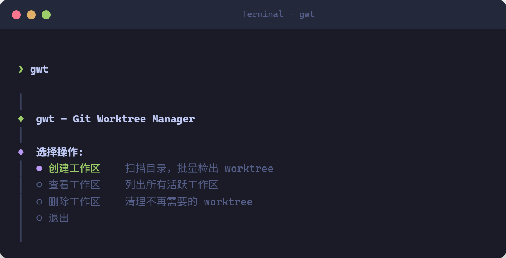
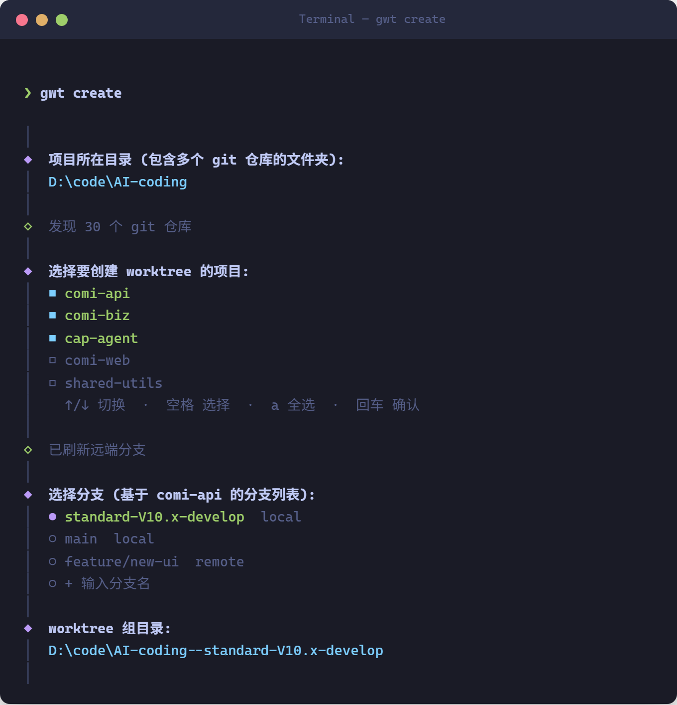
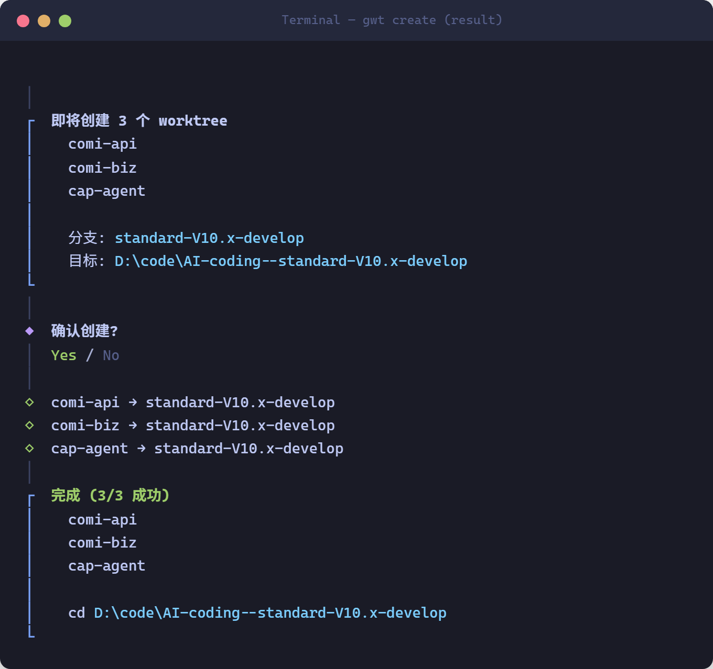
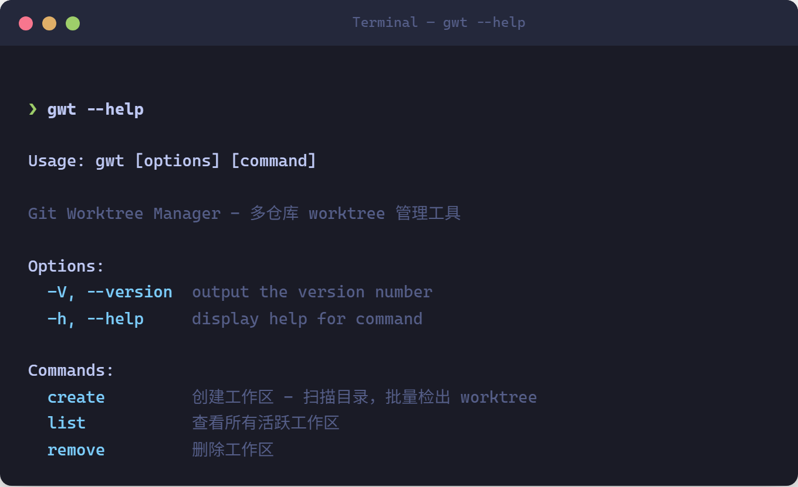

# gwt — Git Worktree Manager

[中文](#中文) | [English](#english)

---

## 中文

批量管理多仓库 git worktree 的 CLI 工具，TUI 交互界面。

如果你的项目目录下有很多相互依赖的 git 仓库，需要同时切换到同一个分支进行开发，`gwt` 可以一键批量创建 worktree。

### 痛点

```
D:\code\AI-coding\
├── service-a/  (main)
├── service-b/  (main)
├── service-c/  (main)
└── shared-lib/ (main)
```

需要在所有项目上开发 `feature/new-ui`，手动逐个 `git worktree add` 太累了。

### 解决方案

```bash
gwt create
```

自动扫描目录、选择项目、选择分支，一键批量创建：

```
D:\code\AI-coding\                          # 原始目录
├── service-a/  (main)
├── service-b/  (main)

D:\code\AI-coding--feature--new-ui\         # 自动创建的 worktree 组目录
├── service-a/  (feature/new-ui)
├── service-b/  (feature/new-ui)
```

### 截图

**交互式菜单**



**创建流程 — 选择项目和分支**



**创建结果**



### 安装

```bash
npm install -g @siwash/gwt
```

需要 Node.js >= 18，Git >= 2.20。

### 使用

#### 交互模式

```bash
gwt
```

启动 TUI 菜单，选择操作。

#### 命令

```bash
gwt create    # 扫描目录 → 选项目 → 选分支 → 批量创建 worktree
gwt list      # 查看所有活跃工作区
gwt remove    # 删除工作区（清理 worktree 并删除目录）
```



#### 创建流程

1. 输入项目所在目录（包含多个 git 仓库的文件夹）
2. 多选要包含的项目
3. 从分支列表中选择（或输入新分支名）
4. 确认目标目录（默认 `<源目录>--<分支名>`，`/` 自动转为 `--`）
5. 完成 — 所有 worktree 一次性创建

#### 配置

工作区记录保存在 `~/.gwt/config.json`，用于 `gwt list` 和 `gwt remove`。

### 工作原理

- **扫描**：检查目录下所有子文件夹是否包含 `.git`，纯 fs 操作，30 个仓库 5ms
- **拉取分支**：只 fetch 第一个选中仓库的远端分支（8s 超时），避免全量 fetch 卡顿
- **智能分支处理**：
  - 本地已有该分支 → `git worktree add -f`（允许同分支多 worktree）
  - 远端有该分支 → 创建本地跟踪分支
  - 全新分支 → 从 HEAD 创建

---

## English

Batch git worktree manager for multi-project directories. TUI-based CLI tool.

If you work with many interdependent git repos under one directory and need to switch branches across all of them at once, `gwt` does it in seconds.

### The Problem

```
D:\code\my-project\
├── service-a/  (main)
├── service-b/  (main)
├── service-c/  (main)
└── shared-lib/ (main)
```

You need to work on `feature/new-ui` across all of them. Manually running `git worktree add` for each repo is tedious.

### The Solution

```bash
gwt create
```

Auto-scans directory, lets you pick repos and branch, creates all worktrees at once:

```
D:\code\my-project\                          # Original
├── service-a/  (main)
├── service-b/  (main)

D:\code\my-project--feature--new-ui\         # Worktree group (auto-created)
├── service-a/  (feature/new-ui)
├── service-b/  (feature/new-ui)
```

### Screenshots

**Interactive menu**


**Create flow — select repos and branch**


**Result**


### Install

```bash
npm install -g @siwash/gwt
```

Requires Node.js >= 18 and Git >= 2.20.

### Usage

#### Interactive mode

```bash
gwt
```

Launches TUI menu with all available commands.

#### Commands

```bash
gwt create    # Scan directory → pick repos → pick branch → batch create worktrees
gwt list      # Show all active workspaces
gwt remove    # Remove a workspace (deletes worktrees and cleans up)
```


#### Create flow

1. Enter the directory containing your git repos
2. Multi-select which repos to include
3. Pick a branch from the list (or type a new one)
4. Confirm target directory (defaults to `<source>--<branch>`, `/` → `--`)
5. Done — all worktrees created in one shot

#### Config

Workspace records are stored at `~/.gwt/config.json`. This file tracks created workspaces so `gwt list` and `gwt remove` work.

### How It Works

- **Scans** a directory for git repos (direct children only, checks for `.git`) — 30 repos in 5ms
- **Fetches** latest branches from the first selected repo (8s timeout, falls back to local cache)
- **Smart branch handling**:
  - Branch exists locally → `git worktree add -f` (allows same branch in multiple worktrees)
  - Branch exists on remote → creates local tracking branch
  - Branch is new → creates it from HEAD

## License

MIT
